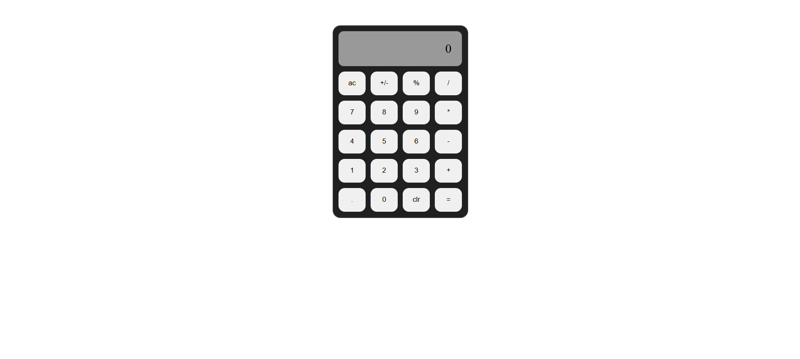

# Calculator

A web-based calculator built with HTML, CSS, and JavaScript. It performs basic arithmetic operations with a clean, user-friendly interface and responsive design.

Features

- Addition, subtraction, multiplication, and division

- Clear (C) button to reset

- Responsive design for different screen sizes

- Intuitive button layout

Technologies Used

- HTML
- CSS
- JavaScript

## 📸 Screenshots

